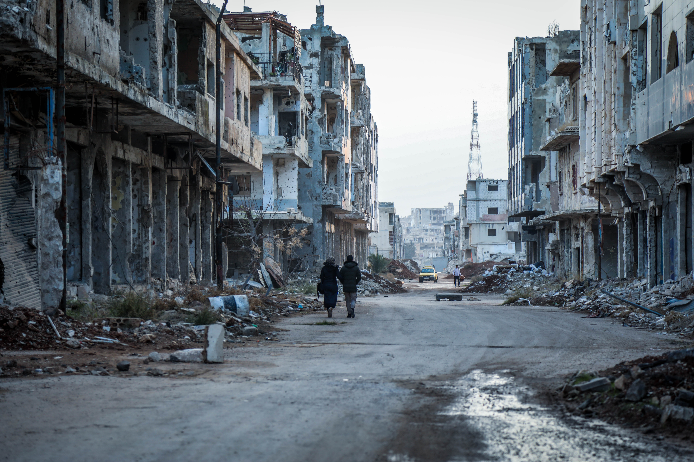

import chart from "./chart";
import ChartFactory from "../../src/components/chartFactory";

  

<a
  style={{ color: "white" }}
  target="_blank"
  rel="noreferrer"
  href={"https://unsplash.com/@mahmoud_ms1"}
>
  {"Photo credit: Mahmoud Sulaiman"}
</a>

I wrote the following essay in a macro economics class that I took back in college.

For six years now, Syria has been embroiled in a bloody conflict that has killed over a hundred thousand people and has displaced millions creating an unprecedented local and global refugee crisis. The war in Syria is extremely complex as there are many international and domestic players involved, all with unique interests and strategies. In this paper, I will be attempting to answer the question of why Syria has become such a fertile land for the myriad of conflicts currently taking place there from the perspective of the Syrian economy. How has Syria’s economy contributed to the shift from the country being relatively stable and safe to it being the stage of so many international conflicts? To answer that question, I will be writing an analysis of the Syrian economy from the year 1970, when Hafez Al Assad took power to 2011, when the Syrian revolution started. There are three reasons that motivated me to choose this time period to analyze. First, it comes right before the start of the Syrian revolution. Second, the Syrian economy changed drastically during it as one of Bashar Al Assad’s main slogans as he was taking power was that he was going to make Syria’s economy more open to the world. Third and most important, a polarization of Syrian public opinion was quickly growing during it too. Throughout this analysis, I will be exploring the different arguments people made and continue to make and putting them somewhere on Kling’s spectrum of the three categories -- liberal, conservative, or libertarian when appropriate to highlight that polarization.

Before I can start analyzing this time period, I must place it within a correct historical context. Syria, like many of its neighbors, has only recently had its current borders drawn. The French and the British, in an agreement called Sykes-Picot, drew the borders dividing the area that comprises current day Iraq, Syria, Lebanon, Jordan, Palestine, and Israel after the Ottomans lost control over those lands. Syria was placed under French mandate until Syrian independence was declared on the 17th of April 1946. In an article titled Syria’s Passage to Conflict: The End of The “Developmental Rentier Fix” and the Consolidation of The New Elite Rule, Shamel Azmeh of the University of Bath describes post-independence Syria like this: “Syria passed through a rocky period that made it one of the most unstable countries in the middle east […] Political power was controlled by land-owning feudal elites many of them Sunnis […] and by an urban elite composed of traditional families, merchants, a few industrialists, and a small professional class, in addition to tribal chiefs.” He goes on to describe how in the face of such a divided economic elite new to independence, a range of anti-establishment, redistribution movements like Arab Nationalism and Socialism were gaining popularity. On top of that, he adds that most minorities, like the Druze, the Alawis, and the Kurds, were marginalized socio-economically, religiously, and culturally. This marginalization led the minorities to embrace those anti-establishment, redistribution ideas even more than the Arab Sunni majority. Hafiz Al Assad was one such Alawi minority member that cleverly used those sentiments to radicalize the ruling Ba’th Party in his favor. In his book Business Networks in Syria: The Political Economy of Authoritarian Resilience, Bassam Haddad, the director of Middle East Studies at George Mason University, argues that “Sectarian identity was used to mobilize support for political goals […] When Assad came to power in 1970, the use of this mechanism of loyalty to further consolidate and insulate the regime internally and externally became more pressing.” Assad’s rise to power was one of the first seeds of the divide of public opinion. People who believed in Hafiz saw him as a strong Arab nationalist leader who protected the minorities from the oppression of the majority. They also praised the stability that he brought to the country after years of dangerous military coups. These arguments clearly fall under the liberal category for demanding freedom for the minorities from the oppression of the majority. Others saw his rise to power as unnatural being the first Alawi president to rule Syria. They also criticized him for his overuse of minorities to suppress the Sunni majority. These anti-Assad arguments have a strong conservative feeling to them as they are more concerned with the preservation of Syria’s power structure staying intact.

Now that Hafiz Al Assad had consolidated his power, he went on to build a unique political economic system that Azmeh calls the Developmental Rentier Fix System. The system’s main mission was to advance stability in the country by appeasing the masses while continuing to consolidate power at the top. Here are some of the key aspects of this system according to Azmeh. It expanded the state-led developmental model. This system included large investments in state owned enterprises, large public infrastructure projects, investments in agriculture, health, and education, and generous subsidies that covered many basic food products. One such infrastructure project that was finished half a decade after Assad took power is the Tabqa dam on the Euphrates River. The dam and the accompanying hydropower station continue to provide water and electricity to a large part of the Syrian population. The state was able to afford those investments in health, education, and infrastructure through revenues from oil exports, official assistance aid from the Arab Gulf countries, and loans from the Eastern Bloc. The state entered a rentier fix economic system that allowed for a large redistributive system. As a result, life expectancy at birth went from 52.8 to 72.3 years from 1960 to 2010. Furthermore, the primary school completion rate went from 55.2% to 100% in that same time period, although, it should be noted here that number is the official number and it is highly contested. While the masses were being appeased, business suffered greatly. State-business mistrust was one of the biggest reasons behind this. The traditional Sunni business elite were unable to trust the regime because they had lost everything to the redistributive system and were now subject to the whims of an Alawi ruler. On the other hand, the Alawi bureaucrats did not trust the Sunni elite because they still remembered how they were oppressed by that elite before Assad. This, argues Haddad, led to the creation of state-business networks. These networks would bring certain state officials and capitalists together allowing both parties to make a profit. Due to the strong antagonism of the Alawi state actors towards the Sunni elite and vice versa, neither party in those networks would be able to openly share that they collaborating with each other allowing a lot of room for corruption and cronyism. This economic system divided public opinion even further, capital owners affiliated with the regime and high ranking state officials loved it simply because they were the main beneficiaries. Farmers in the rural parts of the country from all ethnicities and religions also found this system very favorable because this system of subsidies helped alleviate the poverty they had been living in for so long. This helped Assad supporters to further strengthen their liberal argument in favor of the Assad regime. Almost all arguments that this system was bad for business were quickly dismissed as being selfish reactions to an inclusive redistributive system.

This system could not be maintained politically or economically due to the following reasons. First, the assistance aid that Syria was receiving from the Arab Gulf states started declining from the early 1980’s until it stopped around the end of that decade. Second, there was a serious decline in oil output. According to an article also by Bassam Haddad titled The Political Economy of Syria: Realities and Challenges, the energy sector provided precious petrodollars that the government had used for far too long to make up for deficits in other sectors. Haddad’s paper includes a BP statistical report that shows Syria’s oil production between the years 1998 and 2008; a steady decrease is obvious with production starting at 576 thousand barrels daily in 1998 and ending with 398 thousand barrels daily in 2008. Third, a serious drought continued to hit the country’s agriculture sector hard until today. Even before the war had started, a different kind of migration crisis was already in place in Syria. Haddad: “Recent reports speak of a migration epidemic; entire villages are being abandoned by their residents. It is impossible for the value added provided by the agricultural sector to revert to the 2001 figure of 27 percent.” While misguided and ill intending, in my opinion, the people that make the argument that Syrian refugees are economic refugees rather than humanitarian ones today frequently use this pre-war migration fact to support their claims. Fourth, according to Azmeh: “Syria’s fiscal position was deteriorating fast. By the 2000s, Syria had one of the highest ratios of food and energy subsidies to GDP in the Middle East and North Africa.” This reflects the rapid growth in the population that was not accompanied by growth in job opportunities. Fifth, the Cold War represented a major challenge to this system with regard not only to aid and debt but also to manufactured exports to East European markets. Critics of the Assad regime saw this failure of the rentier fix system as proof that the Assad regime’s economic successes are unsustainable while proponents of his regime saw it as a result of economic externalities that Assad could not have anticipated.

The failure of the developmental rentier fix system and the ascension of Bashar Al Assad to power after the death of his father led to some drastic changes in the economy. Bashar launched the country into a phase of heavy reforms in the hopes of rescuing the country from its economic troubles. According to Shamel Azmeh: “In 2005, Bashar Al Assad, at the Ba’th Party conference, consolidated his political power and launched a new economic vision for Syria. The country was to undergo a transition process into a ‘social market economy’ […] The transition to a market social economy consisted of a number of key macro policies: limiting the socio-economic role of the state, triggering economic growth through promoting private investments, attracting foreign direct investments, and liberalizing trade.” These economic policies opened up more and more opportunities to private investors. The government made a strong attempt at attracting foreign aid with a lot of it coming from the oil rich Gulf states. These investments took an extreme in the example of a project that was planned for the city of Homs. According to Azmeh, “Homs Dream” was a project sponsored by the governor of the city, a personal friend of the president, and a Qatari company called Addiyar. The project called for the complete rebuilding of the city center to transform it into a Dubai-style modern center. This project illustrates the strict top down approach that the government was taking when implementing its vision for the country perfectly. Homs is one of the oldest cities in the world and radically transforming it like this made a lot of its residents angry because they were not consulted about this project at all and they feared that this would destroy the heritage of the city. The government was ready to do absolutely anything to attract foreign investment without taking the needs or the desires of the people into account.

Here are some of the issues that this new social market economy did solve. First, by attracting a lot of foreign investment, Syria was essentially able to bring in a new source of rent. This, in turn, helped make up the deficit that the Syrian economy had been facing as a result of the failure of the rentier fix system. Second, the economic elite started becoming a lot more diverse. Azmeh explains: “It is important to note that this new economic elite and the young professional class created by the economic liberalization was largely multi-sectarian and included Sunnis, Alawis, and Christians. Whereas the earlier period of the regime had been characterized by a very low level trust between the minoritarian, mostly Alawi, state power holders and the urban, mostly Sunni, holder of capital[…] Furthermore, sectarian identities within the elite were becoming increasingly blurry […] Interfaith marriages were becoming more common. The new elite had a clearly globalized life style and aspiration […] The picture was enhanced by growing numbers of Western tourists visiting Syria. The presidential couple aimed to represent the image of this new globalized multi-sectarian elite and middle income class to both the domestic and international audience […] The combination of these economic and sociocultural factors to the rise of a group that is best described as the ‘Basharites.’ Those are young somehow socially liberal, globally oriented members of the economic elite and middle class who like neither the regime and its ‘rough military image’ nor the Ba’th party, but do like Bashar and his wife.” This pluralization of the elite and the middle class led to a significant growth in the global identity among young Syrians. Third, the middle class was experiencing a consumerist boom as goods from all over the world were now slowly being allowed into the country. These regime changes allowed regime supporters to use two new arguments to defend it. First, they were finally able to defend the regime against accusations of sectarianism by being able to point to the new multi-sectarian elite and say that the regime is becoming more inclusive. Second, they also started making the libertarian argument that the regime is finally loosening its grip on the economy and allowing people to make their own economic decisions freely.

While the social market economy looked promising at first glance, there are many deep underlying problems that it either created or failed to address. First, the extremely generous foreign investment coupled with the unabashed existing state-business elite led to some very interesting results. For example, controlling the exclusive dealership rights for key car companies became an important area of competition for those elite. Back when I was in Syria, people would often make the joke that the reason that Syria does not have a Mercedes dealership is that Rami Makhlouf, the maternal cousin of Bashar Al Assad and one of the country’s biggest business moguls, wanted the dealership rights but Mercedes rejected him so Rami told the president to ban Mercedes cars from the country. I have not been able to determine whether that joke has any connection to the truth but the mere fact that most people seemed to believe it is very telling. There was a growing mistrust among the common people of the large power that business moguls associated with the regime started wielding. Second, another key aspect of this new system was that it claimed to be liberalizing the economy. However, this was in fact circumscribed liberalization which Haddad defines as: ”aa pattern of economic liberalization including privatization that is embedded in and largely limited to an already established informal network of public-private ties, whereby the beneficiaries of the old and new arrangements are essentially the same […] In other words this function lets market practices, however corrupt, creep into a rhetorically socialist system.” A criticism that can easily be levied on this circumscribed liberalization is that it sounds exactly like Hayek’s Road to Serfdom. In his famous book, Hayek explains that “planning and competition can be combined only by planning for competition but not by planning against it.” It was clear that the government was actually planning against competition as it maintained a political economy that gave business moguls associated with the regime an extreme advantage over competitors. This combination of selfish planning and free market was indeed detrimental to the health of the Syrian economy.

Third, the drought continued to loom over the country with the slums of cities like Aleppo and Damascus growing every day due to the migration of farmer families from surrounding rural areas. This, in turn, led to very high unemployment that neither the shrinking public sector nor the growing private sector could absorb because most of those migrants were only skilled in agriculture. This high unemployment caused by the drought was amplified further by the constantly growing Syrian population. Haddad: “The job-generation problem continued to intensify under Syria’s high rate of population and its relatively young population. The high number of entrants to the work force per year at the turn of the century placed unprecedented pressure on the government to generate employment.” Fourth, this new system led to very negative effects on redistribution which is one of the main tools that the old system used to appease the masses. This came as a result of what Haddad describes as the shadow economy. Haddad defines it as: “A sphere that is beyond regulation, not least because it is itself crawling with ‘regulators’ or their protégés. It is a sphere that by definition and in practice cannot be legally regulated. The enormous size of the shadow economy before 2005 reflected informal processes of transferring wealth from the public economy to the private economy.” Because the large subsidies of the rentier fix system had no place in the new social market economy, most Syrians started to depend on this market that is not regulated by the state and is not subject to subsidies. Due to all of those factors, from 2005 to 2011, Syria saw a 10 percent increase in poverty. On that topic Haddad states that “many Syrians suffered through a “social gap” under Ba’athist socialism, but the introduction of liberal reforms led to a significant deepening of this gap with little to no positive trickle-down effect.” What’s worse is that this poverty crisis was accompanied by a strong belief among those affected that the “state was abandoning the poor for the sake of the rich” as one of the members of Assad’s internal advisory committee warned him in 2009. It is important to note, however, that most urban economic elites remained loyal to the regime throughout this whole crisis as they found the newly freed market very good for business.

The severe problems with the social market economy outlined above created fertile circumstances for a rebellion. However, that rebellion did not materialize as it needed a catalyst and that catalyst did not present itself until the Arab Spring came along. An unprecedented wave of protest movements asking for equality of opportunity, economic reform, and regime change was taking surrounding countries by storm. TV channels like Al Jazeera and Al Arabiya covered these protest movements very closely from Tunisia to Egypt to Libya to Bahrain. The slogans these protesters used on TV were in crystal clear Arabic, the regimes being toppled or changed looked very similar to Assad’s regime, and the sentiments these protesters had were shared by many Syrians. As a result, in March 2011, a group of elementary school students sprayed the slogan, “the people want to topple the regime” on the walls of their school in the southern city of Dara’a. The regime responded by detaining all the boys, torturing them, and not returning them until intelligence agents had pulled all their finger nails in their torture dungeons. The proud tribal nature of Dara’a compounded with its deeply affected agricultural nature led the people of the city to revolt. The regime’s first response to dissent was violent suppression that would frequently end in opening fire on protesters. It did not take long for Dara’a’s revolt to spread across the country and turn into what Assad protesters started calling The Syrian Revolution. When The Doctor’s Union of Aleppo went on a protest, many college students joined the protest thinking that being with the intellectual elite of the city would make the regime’s secret forces think twice before using violence with them. A couple of doctors were killed and many other college students were arrested for a night or more. The funeral of one of the killed doctors the next week was so big that it turned into a protest itself. Revenge against the regime’s tactic of violent suppression was quickly becoming the fuel that the revolution was running on.

While the plight of the poor farmers affected by the selfish, violent, and oppressive policies of the regimes managed to attract the support of a good chunk of the middle class, at least half of the country remains loyal to the regime until today. Regime supporters are broadly categorized into three groups. First, the state-business elite that don’t want to lose their power and money. Second, the minority members scared of the return of the oppression of the Arab Sunni majority. Third, the middle class passive consenters that don’t have enough motivation to revolt against the ruthless regime. Polarization of public opinion was reaching pre-civil war levels at this point. The violently oppressed opposition called for sectarian and monetary equality while supporters talked of national unity and started calling protesters traitors to the country. This is the clearest example of what Kling describes as groups talking over each other rather than to each other. When the CIA gave the green light to countries like Saudi Arabia, Turkey, and Qatar to start funneling weapons and money into the country to arm the mainly peaceful revolution around mid 2011, the poor did not need much convincing to start forming armed factions against the regime as the alternative was poverty and unemployment. The deeply polarized population was quickly engaged in a bloody civil war that would later make the country into the stage of many regional and international conflicts.

Economic analysis past this point is very difficult as the economy started to completely disintegrate as a result of full-on war that the country is still going through. To summarize, the unstable nature of post-independence Syria allowed the Assad regime to control the country. The Assad regime’s highest priority was stability and power consolidation. It attempted to accomplish its goals by first implementing a rentier fix system that was put in place mainly to appease the masses without actual economic development. The rentier fix worked for a short while until the sources of rent that the it depended on dwindled one by one. The regime under Bashar attempted some reforms under the guise of a social market economy that had limited successes. The failures of the social market economy outweighed the successes heavily, however. All the while, a brutal drought had been creating massive unemployment and poverty, putting enormous extra pressure on an already failing economic system. This resulted in a fertile society for a rebellion. The regime’s mistreatment of the rebellion coupled with the Arab Spring paved the way for a country wide rebellion that would later turn into a civil war. Outside players took advantage of the messy nature of the revolution and turned it into a war by adding weapons and funding to the mix.
